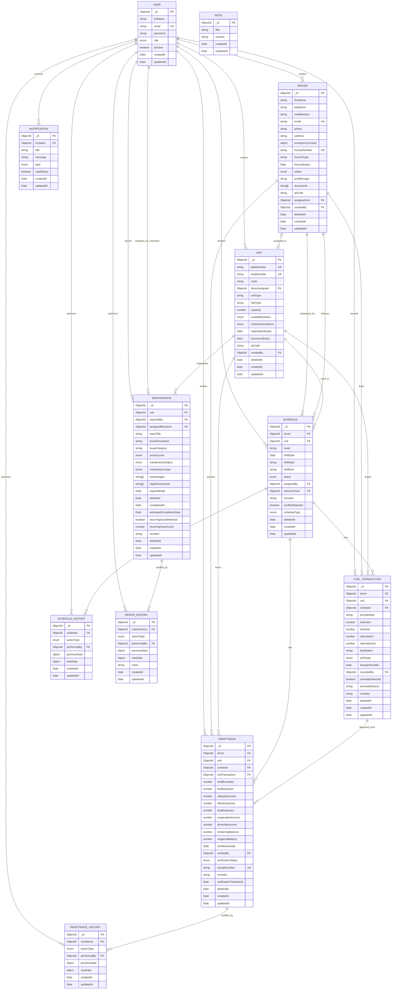

# Entity Relationship Diagram

This ERD is based on the Mongoose models in `backend/src/models`.

```mermaid
erDiagram
  USER {
    ObjectId _id PK
    string fullName
    string email UK
    string password
    enum role
    boolean isActive
    Date createdAt
    Date updatedAt
  }

  DRIVER {
    ObjectId _id PK
    string firstName
    string lastName
    string middleName
    string email UK
    string phone
    string address
    object emergencyContact
    string licenseNumber UK
    string licenseType
    Date licenseExpiry
    enum status
    string profileImage
    string[] documents
    string qrCode
    ObjectId assignedUnit FK
    ObjectId createdBy FK
    Date deletedAt
    Date createdAt
    Date updatedAt
  }

  UNIT {
    ObjectId _id PK
    string plateNumber UK
    string bodyNumber UK
    string route
    ObjectId driverAssigned FK
    string unitType
    string fuelType
    number capacity
    enum availabilityStatus
    enum maintenanceStatus
    Date registrationExpiry
    Date insuranceExpiry
    string qrCode
    ObjectId createdBy FK
    Date deletedAt
    Date createdAt
    Date updatedAt
  }

  SCHEDULE {
    ObjectId _id PK
    ObjectId driver FK
    ObjectId unit FK
    string route
    Date shiftDate
    string shiftStart
    string shiftEnd
    enum status
    ObjectId assignedBy FK
    ObjectId relieverDriver FK
    string remarks
    boolean conflictDetected
    enum scheduleType
    Date deletedAt
    Date createdAt
    Date updatedAt
  }

  FUEL_TRANSACTION {
    ObjectId _id PK
    ObjectId driver FK
    ObjectId unit FK
    ObjectId schedule FK
    string qrCodeData
    number fuelLiters
    number fuelCost
    number odometerIn
    number odometerOut
    string fuelStation
    enum shiftType
    Date transactionDate
    ObjectId recordedBy FK
    boolean anomalyDetected
    string anomalyReason
    string remarks
    Date deletedAt
    Date createdAt
    Date updatedAt
  }

  REMITTANCE {
    ObjectId _id PK
    ObjectId driver FK
    ObjectId unit FK
    ObjectId schedule FK
    ObjectId fuelTransaction FK
    number totalBoundary
    number fuelDeduction
    number salaryDeduction
    number otherExpenses
    number totalExpenses
    number cooperativeIncome
    number driverNetIncome
    number remainingBalance
    number negativeBalance
    Date remittanceDate
    ObjectId verifiedBy FK
    enum verificationStatus
    string receiptNumber UK
    string remarks
    Date verificationTimestamp
    Date deletedAt
    Date createdAt
    Date updatedAt
  }

  MAINTENANCE {
    ObjectId _id PK
    ObjectId unit FK
    ObjectId reportedBy FK
    ObjectId assignedMechanic FK
    string issueTitle
    string issueDescription
    string issueCategory
    enum priorityLevel
    enum maintenanceStatus
    enum maintenanceType
    string[] issueImages
    string[] repairDocuments
    Date reportedDate
    Date startedAt
    Date completedAt
    Date estimatedCompletionDate
    boolean recurringIssueDetected
    number recurringIssueCount
    string remarks
    Date deletedAt
    Date createdAt
    Date updatedAt
  }

  NOTIFICATION {
    ObjectId _id PK
    ObjectId recipient FK
    string title
    string message
    enum type
    boolean readStatus
    Date createdAt
    Date updatedAt
  }

  SCHEDULE_HISTORY {
    ObjectId _id PK
    ObjectId schedule FK
    enum actionType
    ObjectId performedBy FK
    object previousData
    object newData
    Date createdAt
    Date updatedAt
  }

  REMITTANCE_HISTORY {
    ObjectId _id PK
    ObjectId remittance FK
    enum actionType
    ObjectId performedBy FK
    object previousData
    object newData
    Date createdAt
    Date updatedAt
  }

  REPAIR_HISTORY {
    ObjectId _id PK
    ObjectId maintenance FK
    enum actionType
    ObjectId performedBy FK
    object previousData
    object newData
    string notes
    Date createdAt
    Date updatedAt
  }

  NOTE {
    ObjectId _id PK
    string title
    string content
    Date createdAt
    Date updatedAt
  }

  USER ||--o{ DRIVER : creates
  USER ||--o{ UNIT : creates
  USER ||--o{ SCHEDULE : assigns
  USER ||--o{ FUEL_TRANSACTION : records
  USER ||--o{ REMITTANCE : verifies
  USER ||--o{ MAINTENANCE : reports
  USER ||--o{ MAINTENANCE : assigned_as_mechanic
  USER ||--o{ NOTIFICATION : receives
  USER ||--o{ SCHEDULE_HISTORY : performs
  USER ||--o{ REMITTANCE_HISTORY : performs
  USER ||--o{ REPAIR_HISTORY : performs

  DRIVER o|--o| UNIT : assigned_to
  DRIVER ||--o{ SCHEDULE : scheduled_for
  DRIVER ||--o{ SCHEDULE : relieves
  DRIVER ||--o{ FUEL_TRANSACTION : fuels
  DRIVER ||--o{ REMITTANCE : submits

  UNIT ||--o{ SCHEDULE : used_in
  UNIT ||--o{ FUEL_TRANSACTION : fueled
  UNIT ||--o{ REMITTANCE : earns
  UNIT ||--o{ MAINTENANCE : maintained

  SCHEDULE ||--o{ FUEL_TRANSACTION : has
  SCHEDULE ||--o{ REMITTANCE : has
  SCHEDULE ||--o{ SCHEDULE_HISTORY : audited_by

  FUEL_TRANSACTION ||--o{ REMITTANCE : deducted_from
  REMITTANCE ||--o{ REMITTANCE_HISTORY : audited_by
  MAINTENANCE ||--o{ REPAIR_HISTORY : audited_by
```

